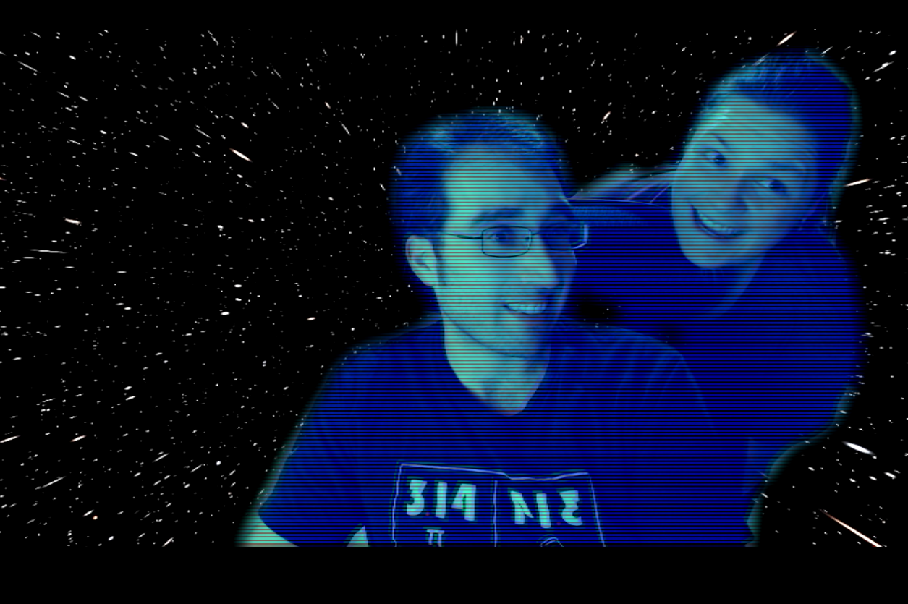

# Open Source Virtual Background

Based heavily on the awesome work from [Ben Elder](https://elder.dev/posts/open-source-virtual-background/)

## Dependencies

- Docker
- `v4l2loopback` Linux Kernel Module

### Optional

- `docker-compose` Sadly it doesn't support `gpus` otherwise it would be the primary container orchestration method

## Quick Start

### Install Dependencies

For Arch Linux with Nvidia Graphics:

`./arch-linux-setup.sh`

For Debian/Ubuntu:

`apt install v4l2loopback-dkms nvidia-container-runtime`

### Build Image

`./build-images.sh`

### Create Fake Camera

`./v4l2loopback-setup.sh`

### Run Containers

`./start-containers.sh`

### Profit!

## Update the Background

Replace `fakecam/background.jpg` with an image of your choosing and rebuild the images.

`./build-images.sh`

## TODO

- [ ] Easy toggle to disable scanlines effect
- [ ] Add more effects
- [ ] Add easier way to update image ( volume mounts? ) 
